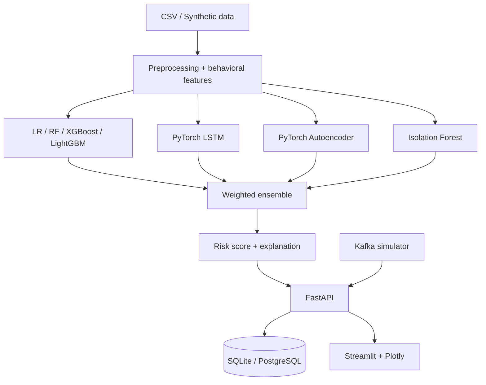

```mermaid
flowchart TD
 A[CSV / Synthetic data] --> B[Preprocessing + behavioral features]
 B --> C[LR / RF / XGBoost / LightGBM]
 B --> D[PyTorch LSTM]
 B --> E[PyTorch Autoencoder]
 B --> F[Isolation Forest]
 C --> G[Weighted ensemble]
 D --> G
 E --> G
 F --> G
 G --> H[Risk score + explanation]
 H --> I[FastAPI]
 I --> J[(SQLite / PostgreSQL)]
 K[Kafka simulator] --> I
 I --> L[Streamlit + Plotly]
```